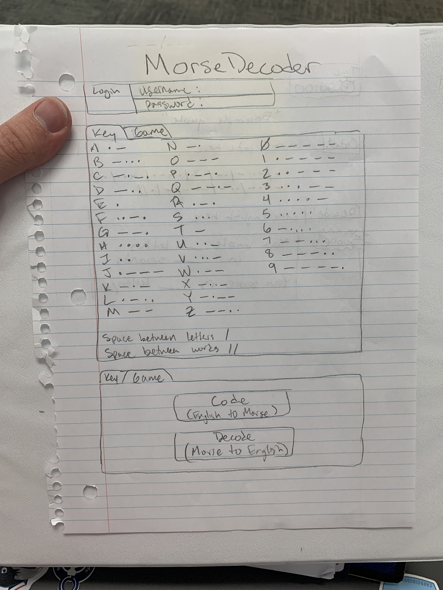
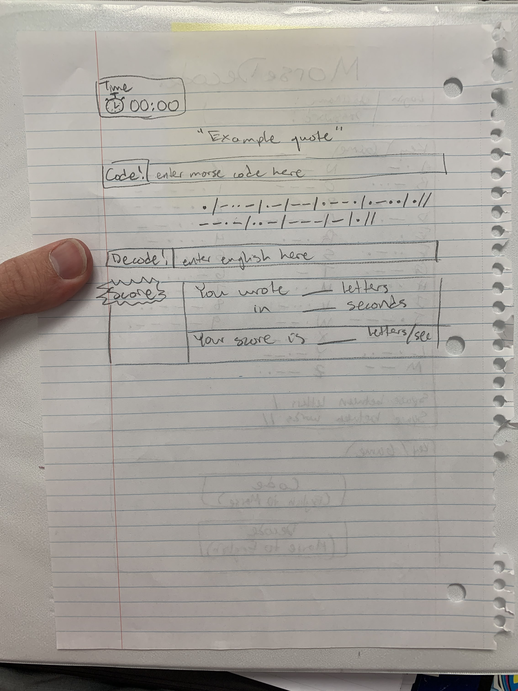

# Morse Decoder
[Notes page](notes.md)
## Elevator pitch
Have you ever wished you knew another language? Do you sometimes wish to hide your darkest secrets in cryptic messages for the unlearned to scratch their heads at? Morse Decoder give you the opportunity to brush up on your skills in Morse code. You will have the opportunity to both codify and decodify messages in Morse code. As you practice more and more, see your speed/score get better and better! Become one of the top players and become a Morse code master!
## Design

## Key Features
* Secure login over HTTPS
* Ability to choose between translating to or from Morse code
* Morse code key page available to consult
* Top scores recorded and displayed
* Top players recorded and displayed
## Technologies
* HTML - Login page, Morse Code Key page, Game menu, Game page 1 (English to Morse), Game page 2 (Morse to English), scoring page.
* CSS - Application styling that looks good on different screen sizes, uses good whitespace, color choice and contrast. Little animation for scoring page. Sounds coordinated to morse letters to match the rhythm.
* JavaScript - Allows for navigation of different pages, login functionality, and recognizes user input to compare to translation.
* React - Provided login, display high scores of other users, and routing and components.
* Service - Backend service with endpoints for:
  - login
  - retrieving high scores
  - displaying top players
  - obtaining quotes or sentences from other API to translate
* DB/Login
  - Store users, scores, and top players in database. Register and login users. Credentials securely stored in database. Can't play unless authenticated.
* WebSocket
  - As players score their deecoding/coding, the top players and their scores are broadcasted to other users.
### HTML
### CSS
### React
### Service
### DB/Login
### WebSocket